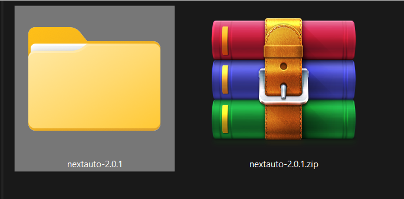
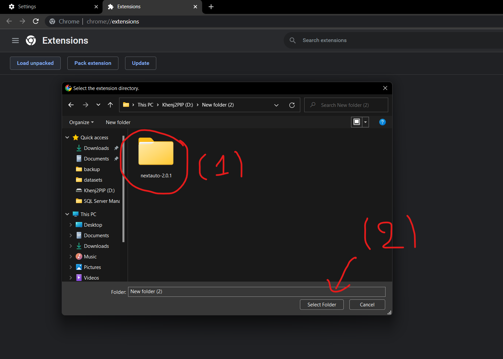
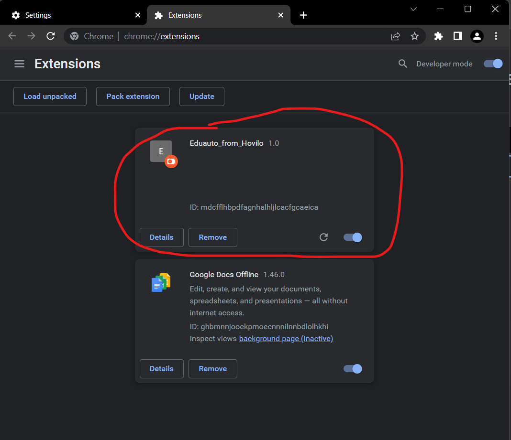

#  Hướng Dẫn Sử Dụng Dành Cho nextauto 

##  Bước 0 ( Tải file nguồn  ) 
> ##### [Ấn vào đây để tải ](https://github.com/khengyun/nextauto/archive/refs/tags/v2.1.0.zip)
- ### Sau khi tải về  =>  tiến hành giải nén

- ### Sau khi giải nén sẽ có 1 folder nextauto như này

- ### LƯU Ý : Tùy Phiên Bản Tên File Sẽ Khác Nhau

##  Bước 1 
- ### Trên trình duyệt chrome, chọn vào dấu 3 chấm -> chọn settings

##  Bước 2
- ### Trong trang settings chọn Extension

##   Bước 3
- ### Phải màn hình -> ấn chọn Developer mode

##  Bước 4
- ### Ấn chọn Load unpacked

##  Bước 5
- ### (1) ấn chọn vào folder nextauto đã được giải nén trước đó 
- ### (2) ấn chọn Select Folder

#  nextauto đã được thêm vào chrome thành công
- ### Giờ thì mở edunext lên nextauto sẽ được chạy tự động

